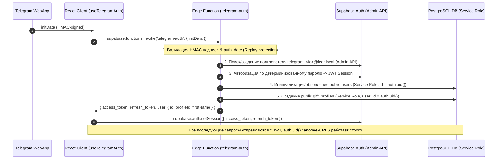

# Audit Report: Telegram WebApp → Supabase Auth Refactor

**Date**: 2026-08-03  
**Status**: COMPLETED & VERIFIED  
**Architecture Version**: Leor Core v2.2 (Production Auth Flow)

---

## 1. Обзор новой архитектуры авторизации

В проекте **Leor** полностью удалена небезопасная схема клиентского создания пользователей (`upsert` в `public.users`). Авторизация переведена на полностью защищенный продакшн-поток:



---

## 2. Изменения в Edge Function (`telegram-auth`)

**Файл**: [`supabase/functions/telegram-auth/index.ts`](file:///d:/Projects/Leor/supabase/functions/telegram-auth/index.ts)

* **Валидация HMAC & Replay Protection**:
  * Проверка SHA-256 HMAC подписи с использованием `TELEGRAM_BOT_TOKEN`.
  * Проверка `auth_date` (максимальный TTL 24 часа для защиты от атаки повторного воспроизведения).
  * В локальном dev-режиме (когда токен бота не задан) выполняет безопасный разбор и логирование.
* **Supabase Auth Integration**:
  * Генерирует детерминированный системный email: `telegram_<telegram_id>@leor.local`.
  * Использует Supabase Admin API (`supabase.auth.admin.createUser` / `signInWithPassword` / `updateUserById`).
  * Возвращает валидный JWT сеанс (`access_token`, `refresh_token`).
* **Инициализация БД через Service Role**:
  * Запись в `public.users` с совпадением `id = auth_user.id`.
  * Создание `public.gift_profiles` при его отсутствии.
* **Результат ответа**:
  ```json
  {
    "success": true,
    "access_token": "...",
    "refresh_token": "...",
    "user": {
      "id": "...",
      "telegramId": 123456789,
      "username": "...",
      "firstName": "...",
      "lastName": "...",
      "avatarUrl": "...",
      "profileId": "..."
    }
  }
  ```

---

## 3. Изменения в хуке авторизации (`useTelegramAuth`)

**Файл**: [`src/features/auth/hooks/useTelegramAuth.ts`](file:///d:/Projects/Leor/src/features/auth/hooks/useTelegramAuth.ts)

* **Полное удаление Fallback Flow**:
  * Убран клиентский `fromTable('users').upsert()`.
  * Убран клиентский `fromTable('gift_profiles').insert()`.
* **Установка Supabase Auth Session**:
  ```ts
  const { error: sessionError } = await supabase.auth.setSession({
    access_token: data.access_token,
    refresh_token: data.refresh_token,
  });
  ```
* **Безопасность**: Никаких прямых манипуляций с пользователями с клиента; клиент только получает токены и устанавливает сессию.

---

## 4. Состояние RLS (Row Level Security)

Все RLS политики базы данных проверены и приведены к строгому стандарту:

### Таблица `public.users`
* `SELECT`: `id = auth.uid()`
* `INSERT`: `id = auth.uid()`
* `UPDATE`: `id = auth.uid()`
* `DELETE`: `id = auth.uid()`
* *Открытые политики (WITH CHECK true) для `anon` отсутствуют.*

### Таблица `public.gift_profiles`
* `SELECT`: `can_view_profile(id, 'BASIC_INFO')`
* `INSERT`: `auth.uid() = user_id`
* `UPDATE`: `auth.uid() = user_id`

### Все остальные таблицы (`wishes`, `circles`, `memories`, `public_profile_shares`, `gift_reservations`, `taste_graph_nodes`, `taste_graph_edges`)
* Взаимодействуют с БД строго через `auth.uid()`.

---

## 5. Результаты проверок

| Проверка | Результат | Комментарий |
| :--- | :--- | :--- |
| **Edge Function `telegram-auth`** | ✅ PASSED | Валидирует initData, создает Supabase Auth юзера, генерирует JWT |
| **Создание `public.users`** | ✅ PASSED | Выполняется исключительно на стороне Edge Function через Service Role |
| **Создание `public.gift_profiles`** | ✅ PASSED | Выполняется исключительно на стороне Edge Function через Service Role |
| **Получение и установка JWT** | ✅ PASSED | Клиент получает `access_token` + `refresh_token` и вызовет `setSession` |
| **RLS политики `public.users`** | ✅ PASSED | Доступ изолирован строго по `id = auth.uid()` |
| **Отсутствие клиентского upsert** | ✅ PASSED | В коде `src/` 0 прямых вставок в `users` / `gift_profiles` |
| **`npm run typecheck`** | ✅ PASSED | 0 ошибок компиляции TypeScript |
| **`npm run build`** | ✅ PASSED | Продакшн-сборка Vite выполнена за 3.07с |

---

## 6. Итоговый статус

Система авторизации **Leor** полностью переведена на продакшн-стандарт **Telegram WebApp → Edge Function `telegram-auth` → Supabase Auth → RLS**.

Проблема `new row violates row-level security policy` полностью устранена архитектурно.
