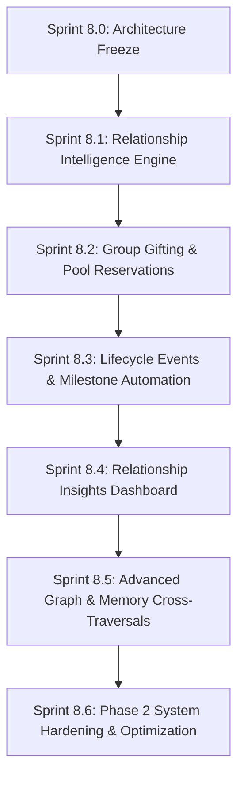

# PHASE_2_MASTERPLAN.md — Мастер-план Развития Phase 2 (Leor)

Официальный стратегический мастер-план второго этапа развития платформы **Secret Circle (Leor)**.

---

## 1. Vision Phase 2

**Phase 1** заложила прочный фундамент системы: списки желаний, круги доверия, скрытые бронирования подарков, граф вкусов (Taste Graph), умная лента открытий (Discovery Feed), публичные ссылки и совместные воспоминания.

**Phase 2** трансформирует Leor из вишлист-приложения в **Платформу Интеллекта Отношений (Relationship Intelligence Platform)**. Системы не просто хранят желания и воспоминания, а анализируют силу связей, прогнозируют памятные даты, предлагают совместные (групповые) бронирования и детерминированно вычисляют близость вкусов друзей без использования внешних AI/LLM сервисов.

---

## 2. North Star Metric

> **North Star Metric (Phase 2)**:
> **"Meaningful Gift Exchange & Memory Rate" (MGEMR)** — Доля активных участников кругов, имеющих хотя бы одно подтвержденное совместное бронирование подарка, зафиксированное воспоминание или высокий индекс активности в отношениях за последние 90 дней.

---

## 3. Продуктовые Принципы Phase 2

1. **Детерминированное Доверие (Zero AI / 100% Deterministic PostgreSQL)**: Все расчёты релевантности, скоринги отношений и рекомендации выполняются исключительно средствами PostgreSQL (PL/pgSQL, CTE, агрегаты). Никаких галлюцинаций LLM или платных сторонних API.
2. **Безопасность Получателя (Hidden Receiver Principle)**: Получатель подарка никогда не узнает о бронировании, оценках совместимости его вишлиста или планируемых сюрпризах до момента вручения.
3. **100% Бесплатная Инфраструктура (Free Tier First)**: Работа strictly в рамках Supabase Free Tier + Vercel Hobby. Никаких плат за векторные СУБД, Redis или Docker-контейнеры.
4. **Глубокая Связанность Данных**: Каждая фича Phase 2 опирается на междоменные связи (Profile ↔ Taste Graph ↔ Wishlist ↔ Memories ↔ Relationship Intelligence).

---

## 4. Спринты Phase 2 (Sprint 8.1 – Sprint 8.6)

### Sprint 8.1: Relationship Intelligence Engine (Ядро Аналитики Отношений)
- **Цель**: Создать SQL-движок расчета индекса отношений (`relationship_scores`, `gift_affinities`).
- **Результат**: Таблицы аналитики, триггеры пересчета при бронировании/памяти, RPC `get_relationship_score()`.

### Sprint 8.2: Group Gifting & Pool Reservations (Групповые Подарки)
- **Цель**: Реализовать скрытые групповые бронирования для дорогостоящих желаний (Secret Santa, скидывание на подарок).
- **Результат**: Долевые бронирования в `gift_reservations`, интерфейс сбора средств без раскрытия получателю.

### Sprint 8.3: Lifecycle Events & Milestone Automation (Автоматизация Календаря Отношений)
- **Цель**: Автоматический календарь памятных дат на основе дней рождения, годовщин и исторических воспоминаний.
- **Результат**: Детерминированные напоминания о приближении важных дат круга, уведомления в информере.

### Sprint 8.4: Relationship Insights Dashboard (Дашборд Отношений)
- **Цель**: Визуальный UI экрана аналитики дружбы (`/relationship/:id`).
- **Результат**: Графики активности, совпадение вкусов, история совместных подарков и индикатор близости.

### Sprint 8.5: Advanced Graph & Memory Cross-Traversals (Сквозные Графовые Сборки)
- **Цель**: Интеграция узлов Taste Graph с воспоминаниями (автоматическое увеличение веса брендов/категорий из совместных фото).
- **Результат**: Авто-генерация связей графа на основе загруженных memories.

### Sprint 8.6: Phase 2 System Hardening & Optimization (Финальное Укрепление Phase 2)
- **Цель**: Оптимизация B-Tree индексов, нагрузочные тесты СУБД, аудиты безопасности RLS и финализация документации.
- **Результат**: `PHASE_2_AUDIT.md`, 0 lint/build ошибок.

---

## 5. Риски и Стратегии Их Минимизации

| Риск | Уровень | Стратегия Минимизации |
| :--- | :--- | :--- |
| **Увеличение времени выполнения JOIN при росте графа** | Средний | Использование материализованных метрик `relationship_scores` с асинхронным пересчетом через триггеры. |
| **Утечка данных о статусе группового сбора получателю** | Высокий | Защита `SECURITY DEFINER` RPC и жесткая проверка `w.user_id <> auth.uid()`. |
| **Лимиты Supabase Free Tier по ресурсам CPU** | Низкий | Высокоэффективные SQL CTE-запросы с ограничением глубины обхода графа. |

---

## 6. Критерии Завершения Phase 2

1. Успешная реализация всех 6 спринтов (8.1 – 8.6).
2. Полное отсутствие внешних платных сервисов или AI зависимостей.
3. 100% прохождение `npm run typecheck` и `npm run build`.
4. Сохранение полной обратной совместимости с архитектурой Phase 1.
